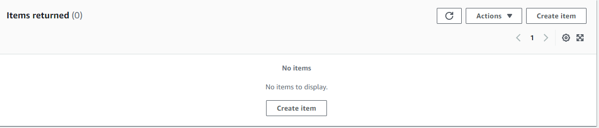

# Wiktor Tomczyk - S3/DynamoDB/Lambda report

- Course: *Cloud programming*
- Group: W04IST-SI0828G
- Date: 16.06.2024

# Environment architecture

# DynamoDB Table (aws_dynamodb_table.games) named "games":
 - Hash key attribute gameId of type S (string).
 - IAM Policy (aws_iam_policy.dynamodb_policy):

# IAM policy named "DynamoDBTablePolicy" that:
 - Secures access to the DynamoDB table with dynamodb:* actions.
 - Restricts access to the table to roles in specific AWS accounts, such as LabRole.

# Cognito user pool named "example-user-pool" configured with:
 - Username attribute set to "email" as the unique attribute.
 - Cognito User Pool Client (aws_cognito_user_pool_client.main):

# Cognito user pool client named "example-user-pool-client" associated with the above user pool.

# VPC, Subnet, Internet Gateway, Route Table, Security Group:

# IAM instance profile named "LabRoleProfile" associated with an IAM role named "LabRole".
# EC2 Instance (aws_instance.my_instance):

# EC2 instance of type t2.small based on AMI ami-080e1f13689e07408 (likely Ubuntu?).

## Preview

Screenshots of configured AWS services. Screenshots of your application running.

# Reflections

In this project, I learned:

 - Understanding of DynamoDB's NoSQL database model and its key components such as tables, items, and attributes.
 - Ability to design efficient table schemas including defining primary keys (partition and sort keys) suitable for different access patterns.
 - Experience configuring DynamoDB settings like billing mode (e.g., PAY_PER_REQUEST) to balance cost and performance.
 - Using spring boot with AWS dynamoDB
 - Using S3 buckets in order to store files on AWS sent by my app, how to upload it and how to download it.
 - Using spring boot with S3
  
I overcame several obstacles during the project, including:

- Backend didn't want to connect with DynamoDB and S3 with provided credentials that I got from metadata of EC2. I didn't have to provide any, because with a role assigned to EC2 it was done automatically.
- Assignin a profile with a role to EC2 instance. I couldn't proceed "terraform apply" on cloud9 env because I was getting an error saying that I didn't have valid credentials. The solution for me was to run "terraform apply" locally on my computer. It turned out that that was a problem with temporary credentials on cloud9. 
- Creating s3 bucket with specified name. The bucket name doesn't allow to provide some characters such as "@" for instance.
- Using spring boot with AWS. I learned how to use some libraries such as software.amazon.awssdk
  
To overcome these obstacles, I found the following resources most helpful:

- StackOverflow
- youtube tutorials
- friends' help
- other internet forums
